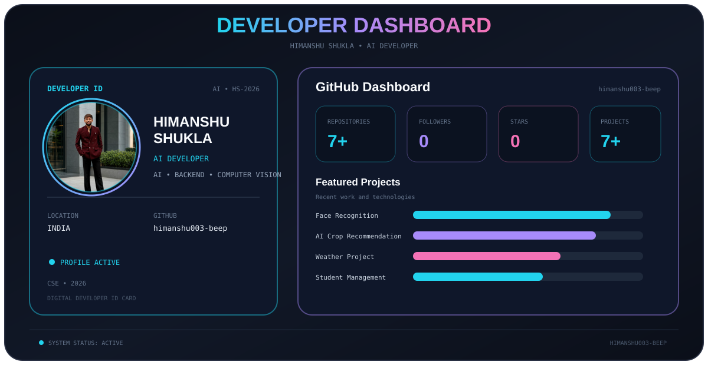

<div align="center">



</div>

<br>

<div align="center">



</div>

<br>

<div align="center">



</div>

<br>

<div align="center">



</div>

<br>

<div align="center">



</div>

---

# 🚀 Featured Projects

Here are some of the projects I have worked on while learning and building with software development, AI, backend development, and computer vision.

### 🤖 AI Face Recognition & Attendance System

An AI-based face recognition system designed for automated attendance management.

**Technologies:**
- Python
- OpenCV
- MTCNN
- FaceNet / InceptionResnetV1
- PyTorch
- FastAPI
- MySQL
- Docker

**Key Features:**
- Face detection
- Face embedding generation
- Face matching
- Attendance logging
- Login / Logout session tracking
- Attendance duration calculation
- Database integration
- REST API

---

### 🌱 AI-Based Crop Recommendation System

An AI-powered system that recommends suitable crops using agricultural and environmental information.

**Technologies:**
- Python
- Machine Learning
- Data Processing
- Weather Data
- GPS
- SQL

**Key Features:**
- Crop recommendation
- Soil-based analysis
- Weather-based information
- Market-related information
- Multilingual interaction
- Voice-based interaction

---

### 🌦️ Weather Project

A weather application developed to work with weather data and API-based information.

**Technologies:**
- Python
- API
- Requests
- HTML
- CSS
- JavaScript

---

### 👨‍🎓 Student Management System

A backend-oriented project for managing student information and operations.

**Technologies:**
- Python
- FastAPI
- Pydantic
- SQL / MySQL
- REST API

---

## 🧠 What I'm Currently Learning

```text
Python
   ↓
Advanced Python
   ↓
Data Structures & Algorithms
   ↓
Backend Development
   ↓
FastAPI & REST APIs
   ↓
SQL & Databases
   ↓
Generative AI
   ↓
Computer Vision
   ↓
Cyber Security